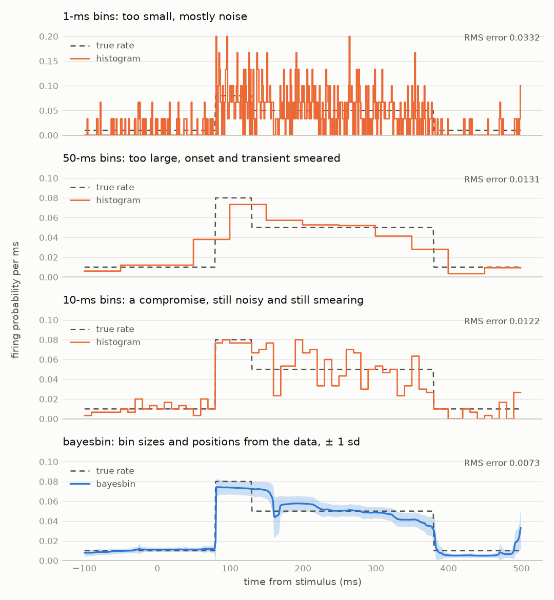
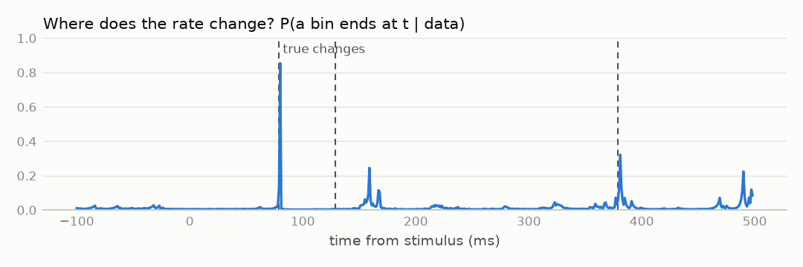

# bayesbin user guide

**bayesbin estimates a rate that changes along an ordered axis — time, position,
dose, age — from counts of events, with error bars, without asking you to choose
bin widths.** It is exact: no fitting by optimisation, no sampling, no tuning of
smoothing parameters.

This guide is for people who want to use it, not derive it. The mathematics is
in the paper (Endres, Oram, Schindelin & Földiák, NIPS 2007); here there is
none beyond the words "average" and "probability".

Contents:

1. [Why not a histogram?](#1-why-not-a-histogram)
2. [The idea in plain words](#2-the-idea-in-plain-words)
3. [How it compares with other methods](#3-how-it-compares-with-other-methods)
4. [Is it right for my data?](#4-is-it-right-for-my-data)
5. [Install](#5-install)
6. [Tutorial 1: spike trains (a PSTH)](#6-tutorial-1-spike-trains-a-psth)
7. [Tutorial 2: event counts with exposure](#7-tutorial-2-event-counts-with-exposure)
8. [Tutorial 3: success rates](#8-tutorial-3-success-rates)
9. [Tutorial 4: a daily profile](#9-tutorial-4-a-daily-profile)
10. [Tutorial 5: data that arrive one at a time](#10-tutorial-5-data-that-arrive-one-at-a-time)
11. [Tutorial 6: change points in a stream without end](#11-tutorial-6-change-points-in-a-stream-without-end)
12. [Choosing the settings](#12-choosing-the-settings)
13. [Reading the results](#13-reading-the-results)
14. [Size and speed](#14-size-and-speed)
15. [Pitfalls and questions](#15-pitfalls-and-questions)

## 1. Why not a histogram?

The usual way to see how a rate changes is to count events in bins of a fixed
width and plot the counts. Everything then depends on the width:

- **Bins too small**: each bin holds a handful of events, and the plot is mostly
  noise. Real features are there, but you cannot tell them from chance.
- **Bins too large**: the noise averages out, but so do the features. A sharp
  onset becomes a ramp, and a short burst is diluted into its neighbours or
  disappears.
- **Bins of one fixed size**: even the best compromise is a compromise
  everywhere. A rate that jumps suddenly and then stays flat for a long time
  needs small bins at the jump and large bins on the flat stretch — no single
  width does both. And where exactly the bin edges fall (at 0, or at 5?) changes
  the picture too.

**The example comes from neuroscience, where the method began.** Nerve cells
(neurons) signal to each other with brief electrical pulses, *spikes*, each
about a millisecond long, and much of what they convey is in how often they
fire. A recording of the times at which one neuron fired is a *spike train*.
To see how a neuron responds to something (a flash of light, a sound), an
experimenter presents it many times and lines the recordings up on the moment
it appeared; counting the spikes in each small time bin across all the
repetitions gives the **peri-stimulus time histogram** (PSTH: "peri-stimulus"
means around the stimulus), the standard picture of a neuron's response. Its
bars estimate the neuron's firing rate at each moment, and its bin width is
exactly the choice described above. Nothing below depends on the biology: the
same problem arises for any events counted over time.

The figure shows 30 repeated trials of a simulated neuron: background firing, a
sudden 50-ms burst after the stimulus, a long plateau, back to background. The
dashed line is the true rate.

<picture>
  <source media="(prefers-color-scheme: dark)" srcset="img/bins-dark.png">
  
</picture>

bayesbin does not pick one binning. It considers every way of cutting the axis
into bins, of every size, and lets the data say how much each one is worth. The
result (bottom panel) has the sharp onset *and* the smooth plateau, an error
band that is narrow where the data are clear and wide where they are not, and
about half the error of the best fixed histogram.

One stretch of the bottom panel looks wrong but isn't: just after the burst,
from 130 to 160 ms, the estimate stays high while the true rate has already
dropped, well outside the shaded band. The data are responsible. In this sample
64 spikes fell in those 30 ms where the true rate predicts 45, a 1-in-230
chance, and the 10-ms histogram above shows the same excess; bayesbin reports
what the data say. The band is ±1 standard deviation, so the truth is expected
outside it about a third of the time. Across 100 simulated datasets it lay
inside ±1 sd at 79% of the time points and inside ±2 sd at 98%.

## 2. The idea in plain words

The model behind bayesbin is simple: **the rate is constant within each bin, and
may jump between bins.** The bins can have any widths, and there can be any
number of them, from one bin for the whole axis up to a limit you set.

For one particular set of bins, it is easy to say how well it explains the
data: a bin that lumps a burst together with a quiet stretch explains the
counts badly; a bin that fits them both well is good. Too many bins are
penalised automatically: each extra bin must earn its place by explaining the
data better, so it only appears where the data demand it (this is the "Occam
factor" of Bayesian model comparison, and it is why no smoothing parameter is
needed).

bayesbin then **averages over all possible sets of bins**, each weighted by how
well it explains the data. There are astronomically many of them, but a
dynamic-programming trick sums over all of them exactly, in a time that grows
only with the square of the axis length. The average of many step functions,
weighted like that, is the estimate you get: sharp where every good set of
bins agrees on a step, smooth where they disagree about where a step is, and
with error bars that come from the same average.

As by-products you get, for free:

- the probability that the rate changes at each point (change points);
- the probability of each number of bins, including the probability that
  there is no change at all;
- the probability of each possible bin.

## 3. How it compares with other methods

**What kind of learning is it?** It learns a function, the rate, along one
axis, from counts. In form that is regression: an input (the time, the
position) and an observed outcome (the counts in each interval). But nobody
tells it where the steps are. The segmentation is structure it finds in the
data by itself, as clustering finds groups; and for spike trains it is
estimating the density of events in time. Both of those are unsupervised
tasks. There are no labels, no training set and no test set: it is Bayesian
model averaging over a family of step functions (in the statistics literature,
a *product partition model*).

**What functions is it good at?** Rates that jump and then stay put: onsets,
offsets, changes of regime, plateaus, sharp and quiet stretches in the same
record. It resolves each part at the scale the data support, fine where the
rate changes quickly and coarse where it doesn't, which no single bin width or
smoothing bandwidth can do. Smooth rates it approximates by averaging
staircases; that works, but a method that assumes smoothness spends the data
more efficiently on them. Oscillations and repeating patterns need many steps:
fold them (Tutorial 4).

**The alternatives**, and when they are the better choice:

- **A histogram or a kernel smoother whose width is chosen from the data**
  (for spike trains, Shimazaki & Shinomoto 2007 and 2010): simple and fast, but
  one width everywhere, and no error bars or change points of their own.
- **Splines and Gaussian processes** (for spike trains, BARS: DiMatteo,
  Genovese & Kass 2001; log-Gaussian Cox processes): they assume the rate is
  smooth and give error bars. Better for rates that really are smooth; slower
  (usually by sampling), with a smoothness to choose or learn.
- **Bayesian Blocks, PELT, hidden Markov models**: step functions too, but one
  best segmentation with a penalty per step that you choose, or a fixed number
  of states that recur.

If I could not use bayesbin: for a quick PSTH, the Shimazaki–Shinomoto kernel;
for a smooth rate with error bars, BARS or a Gaussian process; for change points
alone, Bayesian Blocks, or for a live stream online change-point detection
(Tutorial 6).

**How much better, and with how little data?** On the example of section 1,
with 30 simulated datasets for each number of trials: each method's error
against the true rate (the root-mean-square difference, in firing probability
per millisecond; lower is better), and in brackets that error as a multiple of
bayesbin's.

| trials | **bayesbin** | Shimazaki–Shinomoto histogram | Shimazaki–Shinomoto kernel | best histogram | best kernel |
|---|---|---|---|---|---|
| 2 | **0.0138** | 0.0194 (1.41×) | 0.0196 (1.43×) | 0.0181 (1.31×) | 0.0167 (1.21×) |
| 5 | **0.0110** | 0.0156 (1.42×) | 0.0143 (1.31×) | 0.0149 (1.36×) | 0.0125 (1.14×) |
| 10 | **0.0087** | 0.0125 (1.44×) | 0.0107 (1.24×) | 0.0126 (1.45×) | 0.0102 (1.17×) |
| 30 | **0.0051** | 0.0091 (1.81×) | 0.0078 (1.55×) | 0.0096 (1.89×) | 0.0076 (1.50×) |
| 100 | **0.0022** | 0.0063 (2.92×) | — | 0.0071 (3.27×) | 0.0056 (2.57×) |

The "best" columns choose the bin width or bandwidth *knowing* the true rate,
which no real method can; bayesbin beats them anyway. With few data every
method is limited by the noise, and bayesbin's lead is smallest, but it needs
nothing tuned and does not overfit: with little evidence for steps it uses few
of them, and its error bars widen. With more data it pulls ahead, because it
can be sharp at the onset and smooth on the plateau at the same time. (The
numbers come from `tools/compare_methods.py`.)

## 4. Is it right for my data?

bayesbin fits when all of these hold:

- **One ordered axis.** Time, position along a genome, dose, age, distance:
  anything where "neighbouring" means something. Not for unordered categories,
  and not (yet) for two-dimensional data.
- **Events counted per interval.** Either counts (0, 1, 2, … events in each
  interval, possibly with an *exposure* such as observation time or population
  size) or successes out of trials (a spike or none in each trial; a purchase
  or none per visitor).
- **A rate that is roughly piecewise constant**, or at least can be described
  by steps. Smoothly drifting rates work too, as a staircase; they just need
  more bins.

And these are the assumptions built in — know them, because data that break
them will fool it:

- **Given the rate, events are independent.** For counts this means Poisson
  variation: the spread of counts around their mean is as large as the mean.
  Bursty data, where events come in clumps (retweets, aftershocks, a server
  logging the same error ten times), are *overdispersed*: bayesbin will read
  each clump as a real change of rate and add bins for them. For trials it
  means that trials are independent repeats of the same underlying rate.
- **No preference for smoothness.** Neighbouring bins' rates are unrelated a
  priori; every number of bins up to the limit is equally likely a priori, and
  so is every placement of the boundaries.
- **Every trial follows the same rate profile.** If your trials differ
  systematically (the neuron adapts over the session, the website changed on
  day 3), the estimate is the average profile, and its error bars understate
  the spread between trials.

Good uses: peri-stimulus time histograms, arrival or incident rates, photon or
particle counts, cases per week with population as exposure, conversion or
failure rates along time of day or dose, change-point detection with
uncertainty, daily or weekly profiles.

## 5. Install

```sh
pip install bayesbin              # NumPy/SciPy only
pip install "bayesbin[fast]"      # + numba kernels: ~2x faster, all cores
```

The `fast` version compiles its kernels the first time it is used in a new
environment (about a minute, once); after that they load from a cache.

## 6. Tutorial 1: spike trains (a PSTH)

The example of section 1 (spike trains and PSTHs are explained there): thirty
trials, spike times in milliseconds, recorded from 100 ms before a stimulus to
500 ms after. We simulate them here; with your own data, `trials`
is a list with one array of integer spike times per trial.

```python
import numpy as np
from bayesbin import BernoulliModel, fit, spike_counts

rng = np.random.default_rng(1)
t = np.arange(-100, 500)                       # 600 intervals of 1 ms
p_true = np.select([t < 80, t < 130, t < 380], [0.01, 0.08, 0.05], 0.01)
trials = [t[rng.random(t.size) < p_true] for _ in range(30)]   # 30 trials of spike times

s, g = spike_counts(trials, t_start=-100, t_end=499)
result = fit(BernoulliModel(s, g), max_boundaries=20)
```

`spike_counts` turns the trials into two numbers per millisecond: `s`, how many
trials had a spike there, and `g`, how many did not. `BernoulliModel` says "in
each interval, each trial either has an event or not", and `fit` does the rest.

The estimated firing probability and its error bar at t = 100 ms (index 200,
since the axis starts at −100):

```python
print(f"{result.rate[200]:.4f} ± {result.rate_std[200]:.4f}")   # 0.0739 ± 0.0069 (true: 0.08)
```

`result.rate` is the estimate for every millisecond, and `result.rate_std` its
standard deviation: plot `rate ± rate_std` as in the figure above.

**Did we allow enough bins?** `max_boundaries` is the most bin boundaries
considered. Check that the probability of the largest number is negligible;
if not, raise the limit and fit again:

```python
print(result.m_map, f"{result.m_posterior[-1]:.4f}")   # 7 0.0026: most probable 7 boundaries; 20 is plenty
```

**Did anything happen at all?** The probability of zero boundaries — one flat
rate throughout — is the probability that the stimulus did nothing:

```python
print(f"{result.m_posterior[0]:.1e}")   # 1.7e-76
```

**Where does the rate change?** `result.boundary_posterior[k]` is the
probability that a bin ends right after interval k, averaged over everything
else. Summed over a window, it is the expected number of changes in that
window:

```python
b = result.boundary_posterior
for lo, hi in [(75, 85), (125, 135), (375, 385)]:
    print(lo, hi, round(float(b[lo + 100:hi + 101].sum()), 2))
# 75 85 1.08     the onset at 80 ms: found, and placed to within a few ms
# 125 135 0.05   the burst's end at 130 ms (0.08 -> 0.05): too small a step to be sure of
# 375 385 0.93   the offset at 380 ms: found
```

<picture>
  <source media="(prefers-color-scheme: dark)" srcset="img/boundaries-dark.png">
  
</picture>

Note that the most probable number of boundaries, 7, is more than the 3 real
changes: some fluctuations are ambiguous, and the model keeps them in play with
some probability. Don't read the number of boundaries as the number of real
changes; read the boundary probabilities, which are high only where a change is
well supported.

## 7. Tutorial 2: event counts with exposure

A counter records events every day, but it runs for a different number of
hours each day. The rate we want is events per hour; the hours are the
*exposure*.

```python
from bayesbin import PoissonModel

rng = np.random.default_rng(2)
hours_on = rng.uniform(5, 24, 120)             # exposure: hours the counter ran each day
true_rate = np.where(np.arange(120) < 70, 2.0, 5.0)   # events per hour
counts = rng.poisson(true_rate * hours_on)

result = fit(PoissonModel.weak_prior(counts, hours_on), max_boundaries=6)
print(result.rate[[10, 100]].round(2), result.rate_std[[10, 100]].round(2))   # [2.08 5.1 ] [0.1  0.09]
```

The rate comes out per unit of exposure (per hour), whatever the exposure of
each day. Without an exposure, every interval counts as one unit.

`PoissonModel.weak_prior` picks a mild prior centred on the overall rate, worth
about one event; it lets the data speak. When did the rate change?

```python
day = int(np.argmax(result.boundary_posterior))
print(day, round(float(result.boundary_posterior[day]), 3))   # 69 1.0: after day 69, certainly
print({m: round(float(p), 2) for m, p in enumerate(result.m_posterior) if p > 0.01})
# {1: 0.16, 2: 0.6, 3: 0.19, 4: 0.05}
```

A boundary after interval k means the new rate starts at k + 1 (indexes count
from 0): here the change comes between day 69 and day 70, and it is certain. The model also gives some probability to
a second, weaker boundary elsewhere, but its location is so spread out that no
single day gets more than a few per cent.

## 8. Tutorial 3: success rates

The same Bernoulli model works for any "successes out of trials" data: here,
visitors and buyers per hour of the day.

```python
rng = np.random.default_rng(3)
visitors = rng.integers(200, 400, 24)          # per hour of the day
p = np.where((np.arange(24) >= 9) & (np.arange(24) < 18), 0.06, 0.03)
buyers = rng.binomial(visitors, p)

result = fit(BernoulliModel(buyers, visitors - buyers, sigma=1, gamma=1), max_boundaries=5)
print(result.rate[[3, 12, 21]].round(3), result.rate_std[[3, 12, 21]].round(3))   # [0.031 0.062 0.031] [0.004 0.005 0.005]
print([(h, round(float(x), 2)) for h, x in enumerate(result.boundary_posterior) if x > 0.2])
# [(7, 0.34), (8, 1.0), (17, 0.81)]: a change at 9:00 (right after hour 8; perhaps at 8:00), and at 18:00
```

**Mind the prior here.** `BernoulliModel`'s default prior (`sigma=1,
gamma=32`) expects small probabilities, around 1/33: right for spikes per
millisecond, wrong for conversion rates or failure rates of 10–90%. For those,
use the flat prior `sigma=1, gamma=1`. The prior is worth `sigma + gamma`
imaginary trials per bin, so with hundreds of real trials it barely matters;
with few trials it does.

## 9. Tutorial 4: a daily profile

To learn the shape of a typical day — traffic, calls, arrivals by time of day
— don't feed bayesbin weeks of data as one long series: the same shape would
have to be re-learnt every day, with many boundaries, at great cost. Fold it
instead: add the days up, slot by slot, and use the number of days as the
exposure. Missing data fit in naturally: a slot seen on fewer days has less
exposure.

```python
rng = np.random.default_rng(4)
slot = np.arange(288)                          # 5-minute slots of a day
profile = np.select([slot < 84, slot < 108, slot < 216, slot < 252], [0.5, 2.0, 3.0, 5.0], 1.0)
observed = rng.random((30, 288)) > 0.1         # 30 days; about 10% of slots missing
per_day = np.where(observed, rng.poisson(profile, (30, 288)), 0)

counts = per_day.sum(axis=0)                   # fold: add the days up, slot by slot
days_seen = observed.sum(axis=0)               # exposure: how many days each slot was seen
result = fit(PoissonModel.weak_prior(counts, days_seen), max_boundaries=15)
print(result.m_map, result.rate[[40, 100, 150, 230, 270]].round(2))   # 4 [0.49 1.98 2.99 4.98 1.08]
print([(int(k), round(float(x), 2)) for k, x in enumerate(result.boundary_posterior) if x > 0.5])
# [(83, 1.0), (107, 0.94), (215, 1.0), (251, 1.0)]: all four changes, to the slot
```

The rate is per slot per day. This treats the days as independent repeats of
one profile. If some days are unusual (holidays) or the level drifts over the
weeks, fit the shape on a recent window and model the level separately.

If the busy part of the day runs over midnight, the two ends of the fold are one
stretch of the same rate, which a line cannot know. `fit_cyclic` puts the slots
on a circle, where a bin may wrap round from the last slot to the first:

```python
from bayesbin import fit_cyclic

rng = np.random.default_rng(7)
hour = np.arange(24)
night = (hour >= 21) | (hour < 3)                       # busy from 21:00 to 03:00
counts = rng.poisson(np.where(night, 4.0, 1.0) * 30)    # 30 days, added up hour by hour
model = PoissonModel.weak_prior(counts, np.full(24, 30))
ring, line = fit_cyclic(model, max_boundaries=6), fit(model, max_boundaries=6)
print(ring.rate[[0, 12, 23]].round(2), line.rate[[0, 12, 23]].round(2))   # [3.95 0.98 3.95] [4.05 0.98 3.84]
print([(int(k), round(float(x), 2)) for k, x in enumerate(ring.boundary_posterior) if x > 0.5])
# [(2, 1.0), (20, 1.0)]: bins end at 02:00 and 20:00, none at midnight
```

On the circle the night is one bin, the same rate at 23:00 and 00:00 from both
ends' data (sd 0.16, against 0.22 and 0.26 on the line), and the evidence
prefers it (`log_marginal` 2.7 nats higher). `boundary_posterior` has an entry
for every slot, the last for the gap between the last slot and the first. A
single boundary on a circle is no partition, so M = 1 has evidence 0. The cost
is one linear fit per slot: fold to coarse slots first (a day of hours takes
0.1 s, a week of hours a few seconds).

## 10. Tutorial 5: data that arrive one at a time

For a live stream — a sensor, a log, a feed — `OnlineBinning` keeps the
calculation up to date as each new interval arrives, without starting again.
It answers the questions a stream asks, exactly as a full fit of the data so
far would: what is the rate *now*, when did it last change, and how surprising
is the next count?

```python
from bayesbin import OnlineBinning

rng = np.random.default_rng(5)
stream = rng.poisson(np.repeat([3.0, 9.0], [150, 30]))   # the rate triples at interval 150
ob = OnlineBinning.poisson(alpha=1.0, beta=0.25, max_boundaries=10)   # prior: about 4 per interval

surprise, since_change = [], []
for y in stream:
    surprise.append(float(1 - ob.next_cdf(y - 1)[0]))   # before seeing y: P(a count >= y)
    ob.update(y)
    since_change.append(float(ob.current_bin_start()[150:].sum()) if ob.T > 150 else 0.0)

rate, sd = ob.rate_now()
print(f"{rate:.2f} ± {sd:.2f}")   # 8.41 ± 0.58: the rate now (true: 9)
print([round(p, 3) for p in surprise[148:154]])   # [0.549, 0.942, 0.324, 0.002, 0.144, 0.629]
print(next(k for k, p in enumerate(since_change) if p > 0.95))   # 154: sure of the change 4 intervals on
```

The count of 10 at interval 151 had a 0.2% chance of being that high, given
everything before it; by interval 154 the model is more than 95% sure that a
new bin started after 150. `current_bin_start()` gives the whole distribution
of where the current bin began.

The prior has to be chosen up front (`weak_prior` needs all the data). And one
thing a stream cannot give cheaply: revised estimates of the *past*, which
every new point changes a little. Ask for them when needed, with a full fit of
the data so far:

```python
result = ob.fit()
print(result.rate[[100, 170]].round(2))   # [2.9  8.42]: before and after the change
```

Each update costs time in proportion to the length of the stream so far (and
to `max_boundaries`): about 1–2 ms per interval after a couple of thousand. For
streams without end, use the next tutorial's model.

## 11. Tutorial 6: change points in a stream without end

`OnlineBinning` keeps the batch model, whose prior (any number of boundaries up
to `max_boundaries`, equally likely) suits a record of fixed length: an endless
stream would need ever more boundaries, and every update gets slower.
`ChangePointStream` changes the prior instead: **each new interval starts a new
segment with a small, constant probability** (you give the expected segment
length), and each segment's rate is drawn afresh from the prior. This is
Bayesian online change-point detection (Adams & MacKay 2007). There is no
`max_boundaries`: the model keeps a probability for each possible time since
the last change, and forgets the ones that have become negligible.

```python
from bayesbin import ChangePointStream

rng = np.random.default_rng(9)
stream = rng.poisson(np.repeat([4.0, 4.0, 12.0, 6.0, 20.0], 2000))   # a new rate every 2000 (one repeats)
cp = ChangePointStream.poisson(alpha=1.0, beta=0.1, expected_run_length=1000)

alarms = []
for t, y in enumerate(stream):
    q = cp.pit(y, u=rng.random())   # before the update: uniform in [0, 1) if the model fits
    cp.update(y)
    if cp.p_change_within(10) > 0.99 and t > 10 and (not alarms or t - alarms[-1] > 100):
        alarms.append(t)

print(alarms)   # [4003, 6006, 8001]: the three changes, within a few intervals; none at 2000
rate, sd = cp.rate_now()
print(f"{rate:.2f} ± {sd:.2f}")   # 19.88 ± 0.17
```

`p_change_within(k)` is the probability that the current segment began in the
last k intervals; `run_length_posterior()` gives the whole distribution. The
"change" at 2000 left the rate at 4, so nothing happened that the data could
show, and no alarm was raised.

**Surprise, calibrated.** `pit(y)` is the randomized probability integral
transform of a count before it is added: where it falls in the model's
predictive distribution, uniform between 0 and 1 when the model is right. Values
near 1 are surprisingly high counts, near 0 surprisingly low. Because they are
calibrated, they can be compared across quite different streams, and their
uniformity can be checked: on data from the model the test suite finds them
uniform; on bursty (overdispersed) counts they are far from it, which is the
warning sign that the model does not fit.

**Bursty counts.** If events come in clumps, one story in many reports, one
fault in many log lines, the counts vary more than Poisson counts can, and the
surprise values show it: too many near 1, as in the overdispersed test above.
`ChangePointStream.overdispersed(alpha, beta, expected_run_length)` takes the
same arguments and learns how bursty the stream is: it runs the model for a
range of burstiness levels at once and weights each by how well it has
predicted the data so far (`dispersion_posterior()` shows the weights). It
costs about ten times as much per count.

**When did it change?** `p_change_at(k)` is the probability that a segment
started at the k-th latest interval, with the data since then taken into account
(fixed-lag smoothing: give `lag`, the number of intervals to look back). One high
count is weak evidence of a change; a few more settle where it began:

```python
rng = np.random.default_rng(10)
step = np.concatenate([rng.poisson(2.0, 400), rng.poisson(6.0, 100)])   # the rate rises at interval 400
cp = ChangePointStream.poisson(alpha=1.0, beta=0.1, expected_run_length=1000, lag=10)
cp.update(step[:401])                    # up to interval 400, the first high count
print(round(cp.p_change_at(1), 2))       # 0.05: P(a segment started at interval 400)
cp.update(step[401:406])                 # five more intervals
print(round(cp.p_change_at(6), 2))       # 0.93: the same interval, now the 6th latest
```

It costs about twice as much per update, for any lag up to a few dozen.

**Choosing `expected_run_length`**: how long, on average, you expect a rate to
last. It sets how readily the model believes in a change; the results are not
very sensitive to it within a factor of a few. If you do not know it, let the
stream learn it: `hazard_strength=1.0` makes it a prior guess worth one change
point, which the data soon outweigh (`hazard_posterior()` gives the learnt rate
of changes, 1/its mean the expected segment length), at about twice the cost. **The prior** (`alpha`, `beta`,
or `sigma`, `gamma` for success rates) should cover the rates you expect: a new
segment's rate is drawn from it.

**Cost**: each update costs time in proportion to the number of possible
times since the last change that the model keeps. In a long quiet stretch they
all stay plausible, so the recent ones (up to `exact_recent=128` intervals) are
kept exactly and older ones are merged, 32 buckets per doubling of length
(`merge_bins=32`), each into a single component with the same rate mean and
variance. The state then grows with the *logarithm* of the segment's length:
here at most 245 components instead of 4006, and a 30,000-interval quiet
stream keeps 313 instead of 30,000, 17 times faster, while the rates, error
bars and surprise values move very little: by at most 3·10⁻⁴ (relative, in
the error bars of a stream of large counts with frequent changes), typically
about 10⁻⁵. `merge_bins=None`
keeps every run exactly.

## 12. Choosing the settings

There are few, and the defaults are sensible.

- **`max_boundaries`** (default 10): the most bin boundaries considered. Too
  low, and a real change is forced out; the sign is that `m_posterior[-1]` is
  not small. Raise it until `m_posterior[-1]` is below about 0.001. The time
  grows in proportion to it.
- **The prior of each bin's rate.**
  - `BernoulliModel(s, g, sigma=1, gamma=32)`: a Beta(σ, γ) prior on each bin's
    probability, mean σ / (σ + γ), worth σ + γ imaginary trials. The default
    suits spikes per millisecond; use `sigma=1, gamma=1` for proportions that
    could be anything.
  - `PoissonModel.weak_prior(y, e, weight=1)`: a Gamma prior centred on the
    overall rate, worth `weight` events. Or give it yourself:
    `PoissonModel(y, alpha, beta, e)` with mean α / β, worth α events.
- **`m_mass`** (default: average over every number of boundaries, as the paper
  recommends): `m_mass=0.9` averages over the smallest range of numbers of
  boundaries holding 90% probability, and `m_mass=0.0` uses the most probable
  number alone (as the original program does). The default is best for the
  rate; the others are mainly for comparing with other tools.
- **`keep_bins=True`**: also return `bin_posterior`, the probability of every
  possible bin [a, b]. It needs memory for a T × T table (T intervals), so keep
  it to T of a few thousand.
- **`exact=True`**: do everything in the slow, plain way (the reference the
  tests use). You will not need it.

## 13. Reading the results

`fit` returns a `BinningResult`:

| field | what it is |
|---|---|
| `rate` | the estimated rate in each interval: its posterior mean, averaged over all binnings |
| `rate_std` | its posterior standard deviation: the error bar |
| `boundary_posterior` | for each interval k (but the last), the probability that a bin ends right after it; summed over a window, the expected number of changes there |
| `m_posterior` | the probability of each number of boundaries, 0 to `max_boundaries` |
| `m_map` | the most probable number of boundaries |
| `log_evidence` | log P(data given each number of boundaries), for comparing models |
| `log_marginal` | log P(data), the prior over the number of boundaries included |
| `bin_posterior` | the probability of each bin [a, b], if `keep_bins=True` |

The units of `rate`: for `BernoulliModel`, a probability per trial per
interval; for `PoissonModel`, events per unit of exposure (per interval, if you
gave none).

The streaming classes answer from their current state:

| method | `OnlineBinning` | `ChangePointStream` |
|---|---|---|
| `rate_now()` | the rate in the latest interval and its sd | the same |
| where the current segment began | `current_bin_start()`: P(it starts at a) | `run_length_posterior()`, `p_change_within(k)` |
| the next count | `next_pmf(x, size)`, `next_cdf(x, size)` | the same, and `pit(x, size)` |
| the evidence | `log_evidence`, `m_posterior`, `log_marginal` | `log_marginal` |
| the past | `fit()`: the batch fit of the data so far | — |

## 14. Size and speed

The cost grows with the square of the number of intervals T and in proportion
to `max_boundaries`. Memory grows only in proportion to both. On a 2012 laptop
(4 cores):

| T (intervals) | max_boundaries | NumPy only, 1 core | with `fast`, 1 core | with `fast`, 4 cores |
|---|---|---|---|---|
| 600 | 10 | 0.05 s | 0.02 s | 0.01 s |
| 2016 (a week of 5-minute slots) | 30 | 0.5 s | 0.3 s | 0.1 s |
| 8064 (four weeks) | 120 | 8.7 s | 5.8 s | 2.0 s |
| 12096 (six weeks) | 120 | 19 s | 13 s | 4.3 s |

- With `fast`, it uses all cores. Set `NUMBA_NUM_THREADS` to the number of
  *physical* cores for the best time (hyperthreads don't help).
- Many short series: fit them in parallel from a thread pool, one thread each.
- **Very strong evidence is slower.** Counts in the hundreds or thousands per
  interval, or hundreds of trials with sharp changes, make the numbers span an
  enormous range, and much of the work then falls back to a slower exact path:
  up to about 10 times slower (a week of 5-minute slots at 1000 events per slot:
  about 1 s on 4 cores). Coarser intervals help, as does folding (Tutorial 4).
- Long series of a repeating pattern: fold them (Tutorial 4). It is faster and
  it is the better model.

## 15. Pitfalls and questions

**"more than one spike in an interval: use a finer discretization".**
`spike_counts` assumes at most one spike per trial per interval (the paper's
setting). Use finer intervals, or count spikes per interval yourself and use
`PoissonModel` on the totals.

**My counts are bursty.** See overdispersion in [section 4](#4-is-it-right-for-my-data):
clumps look like changes of rate. Coarser intervals, or de-duplicating the
events, help; the error bars will otherwise be too narrow and the boundaries
too many.

**The estimate curves near the ends.** There are fewer data on the far side of
a boundary near the ends of the axis, so the estimate there is less certain;
the error band shows it.

**The estimate looks smooth, although the model is steps.** That is the
average over binnings: where the data don't say exactly where a step is, the
average of many step positions is a ramp. Where they do, it is a sharp step.

**Why not a kernel smoother?** It has a bandwidth — the same fixed-width
problem as a histogram — and no error bars or change points of its own.

**Why not Bayesian Blocks (astropy)?** It finds the *single* best set of bins,
with a penalty per bin that you choose. bayesbin averages over all of them,
which gives error bars, change-point probabilities, and no penalty to tune.

**Non-integer counts** (e.g. weights) work, on a slower path. **Intervals of
unequal width**: use `PoissonModel` with the widths as exposure.

**Is there a C++ version?** Yes: [binsdfc-fb](https://github.com/petfold/bayesbin/blob/main/cpp/binsdfc-fb/README.fb.md),
the original command-line program by Dominik Endres with bayesbin's algorithms
put into it (the forward–backward bin posterior, O(T·M) memory, OpenMP, the
scaling that keeps data with strong steps fast). It reads spike trains in its
own text format and prints the rate and its error bars; on 4 cores a long
record takes it about 1.5 times as long as bayesbin, in a quarter of the memory. It is
in the repository, under the GPL, not in the pip package; build it with the two
compiler lines in its README.

**More.** The method: [the paper](https://papers.nips.cc/paper_files/paper/2007/hash/b73ce398c39f506af761d2277d853a92-Abstract.html)
and [docs/NOTES.md](NOTES.md) (related papers, the 2-D question, performance
notes). The code: [README](../README.md). The C++ version:
[binsdfc-fb](../cpp/binsdfc-fb/README.fb.md). What changed between releases:
[CHANGELOG](../CHANGELOG.md).
